<!-- g++ -x c++ main.cu bvh.cu -std=c++11 -I ../third_party/glm/ -o bvh_check

nvcc --extended-lambda --expt-relaxed-constexpr -I ../third_party/glm/ main.cu bvh.cu -o bvh_check -->

# Heterogeneous Volume Path Tracer

This branch focuses on heterogeneous participating media. It adds bounded volume regions driven by raw voxel grids, plus optional temperature and flame channels for emissive media such as smoke and explosions.

## CPU Build

```bash
mkdir build && cd build
cmake ..
make -j8
```

## GPU Build

```bash
mkdir build_gpu && cd build_gpu
cmake -DENABLE_GPU=ON -DCMAKE_CUDA_COMPILER=/usr/local/cuda-11.8/bin/nvcc -DCMAKE_CUDA_HOST_COMPILER=/usr/bin/gcc-11 ..
make -j8
```

## Volume Scene Format

Heterogeneous media are described with `volume_region` objects in the scene JSON. Each medium can provide:

- `density_file`, `density_resolution`, and `density_format`
- optional `temperature_file` and `flame_file`
- scattering and absorption controls through `sigma_s`, `sigma_a`, and `g`
- artistic controls such as `density_scale`, `temperature_scale`, `flame_scale`, and `emission_scale`

## Example Scenes

### Cornell Box Baseline vs Fog

<table width="100%">
  <tr>
    <td width="50%" align="center"><strong>No Volume</strong></td>
    <td width="50%" align="center"><strong>Heterogeneous Fog</strong></td>
  </tr>
  <tr>
    <td width="50%">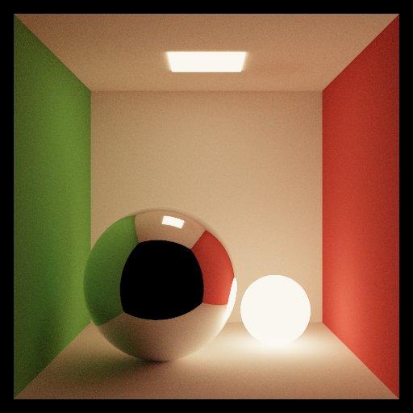</td>
    <td width="50%">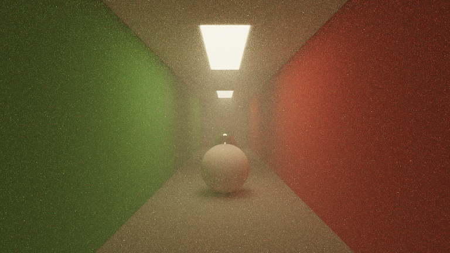</td>
  </tr>
</table>

### Cornell Anisotropy Sweep

<table width="100%">
  <tr>
    <td width="33%" align="center"><strong>g = -0.9</strong></td>
    <td width="33%" align="center"><strong>g = 0.0</strong></td>
    <td width="33%" align="center"><strong>g = 0.9</strong></td>
  </tr>
  <tr>
    <td width="33%">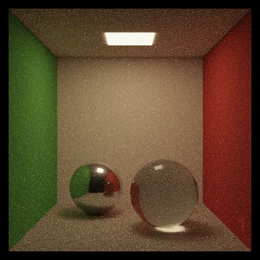</td>
    <td width="33%">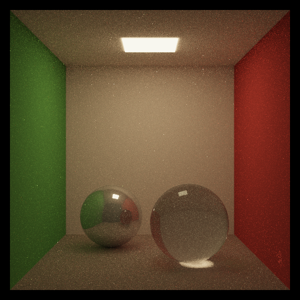</td>
    <td width="33%">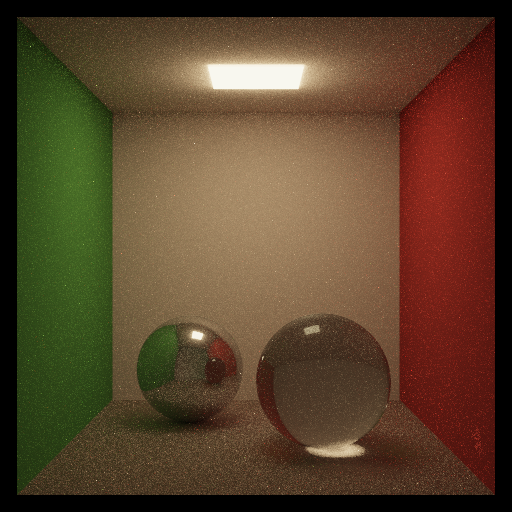</td>
  </tr>
</table>

### Dartmouth Volume Sweep

<table width="100%">
  <tr>
    <td width="25%" align="center"><strong>g = 0.0, t = 0.5</strong></td>
    <td width="25%" align="center"><strong>g = 0.0, t = 1.0</strong></td>
    <td width="25%" align="center"><strong>g = -0.5, t = 1.0</strong></td>
    <td width="25%" align="center"><strong>g = 0.5, t = 1.0</strong></td>
  </tr>
  <tr>
    <td width="25%">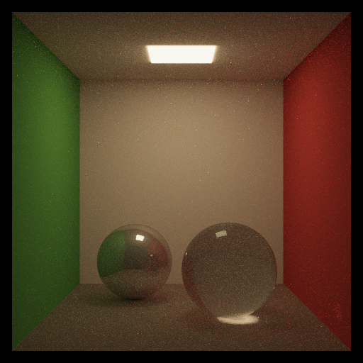</td>
    <td width="25%">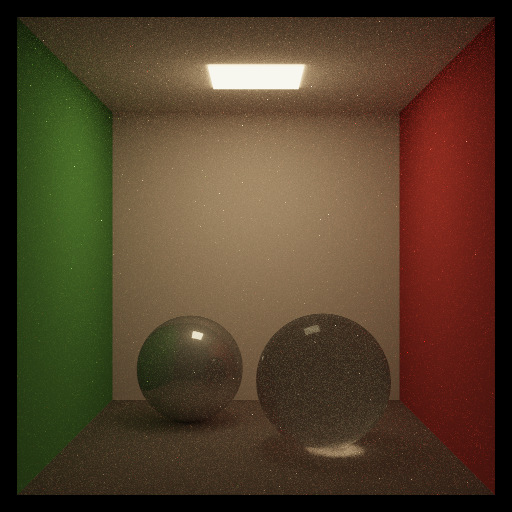</td>
    <td width="25%">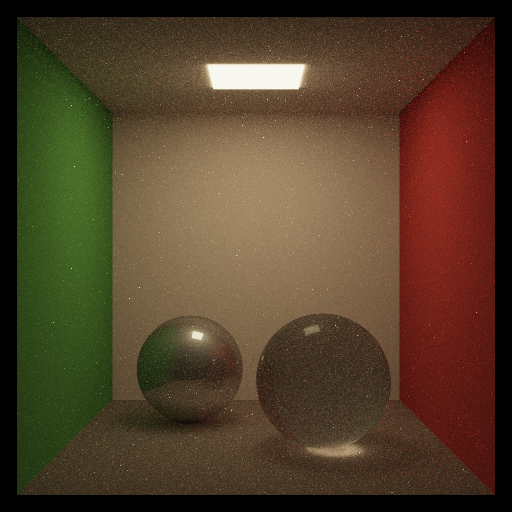</td>
    <td width="25%">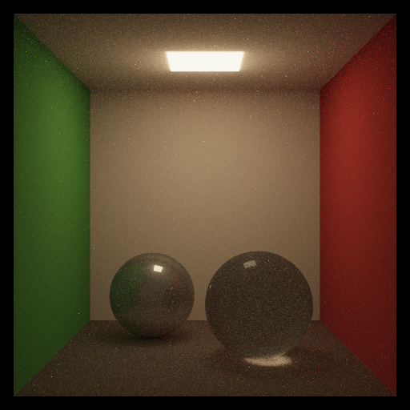</td>
  </tr>
</table>

### EmberGen Smoke Result

Rendered with the GPU build using `assets/json_files/cornell_smoke_embergen_47.json`.

```bash
cd build_gpu
./render ../assets/json_files/cornell_smoke_embergen_47.json -o cornell_smoke_embergen_47_new.png
```


### EmberGen Ablations at 512 spp

All ablations below reuse the `cornell_smoke_embergen_47` setup and vary one heterogeneous-medium parameter at a time.

#### Phase Anisotropy Sweep

<table width="100%">
  <tr>
    <td width="33%" align="center"><strong>g = -0.5</strong></td>
    <td width="33%" align="center"><strong>g = 0.0</strong></td>
    <td width="33%" align="center"><strong>g = 0.5</strong></td>
  </tr>
  <tr>
    <td width="33%">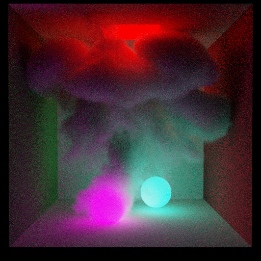</td>
    <td width="33%">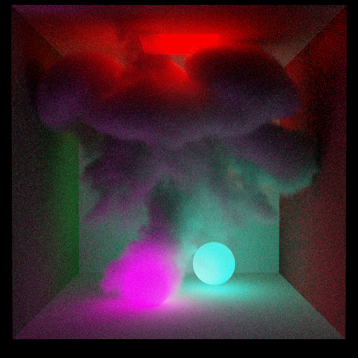</td>
    <td width="33%">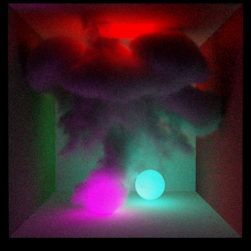</td>
  </tr>
</table>

#### Density Scale Sweep

<table width="100%">
  <tr>
    <td width="33%" align="center"><strong>density_scale = 8</strong></td>
    <td width="33%" align="center"><strong>density_scale = 15</strong></td>
    <td width="33%" align="center"><strong>density_scale = 30</strong></td>
  </tr>
  <tr>
    <td width="33%">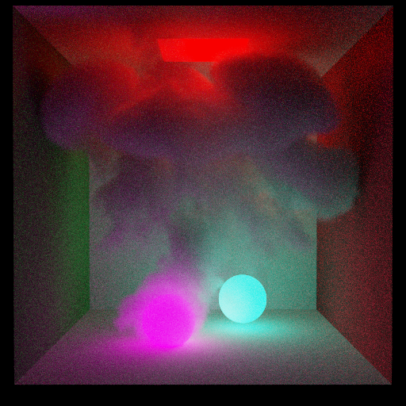</td>
    <td width="33%"></td>
    <td width="33%">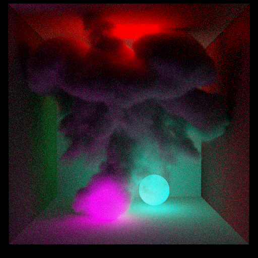</td>
  </tr>
</table>

#### Emission Scale Sweep

<table width="100%">
  <tr>
    <td width="33%" align="center"><strong>emission_scale = 0</strong></td>
    <td width="33%" align="center"><strong>emission_scale = 8</strong></td>
    <td width="33%" align="center"><strong>emission_scale = 32</strong></td>
  </tr>
  <tr>
    <td width="33%">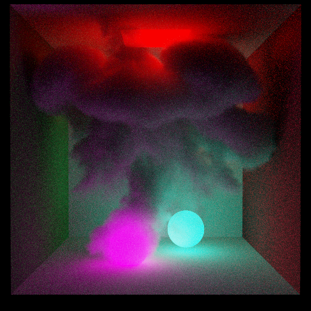</td>
    <td width="33%">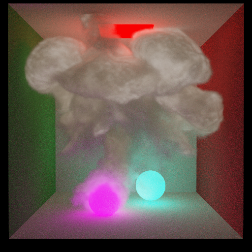</td>
    <td width="33%">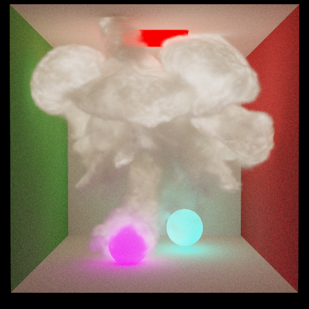</td>
  </tr>
</table>

## Included Volume Presets

- `assets/json_files/cornell_volume_raw.json` for a simple raw density test volume
- `assets/json_files/cornell_fog.json` and `assets/json_files/cornell_hallway_fog.json` for Cornell-style fog scenes
- `assets/json_files/cornell_volume_g0.json`, `cornell_volume_gm09.json`, and `cornell_volume_gp09.json` for anisotropy comparisons
- `assets/json_files/dartmouth_vol_g0_t05.json`, `dartmouth_vol_g0_t1.json`, `dartmouth_vol_gm05_t1.json`, and `dartmouth_vol_gp05_t1.json` for transmittance and phase-function sweeps
- `assets/json_files/cornell_smoke_taichi.json` for a raw smoke field
- `assets/json_files/cornell_smoke_embergen_20.json`, `cornell_smoke_embergen_47.json`, `cornell_smoke_embergen_100.json`, and `cornell_smoke_embergen_120.json` for EmberGen-derived explosion volumes
