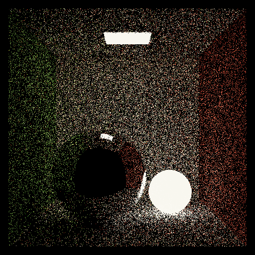
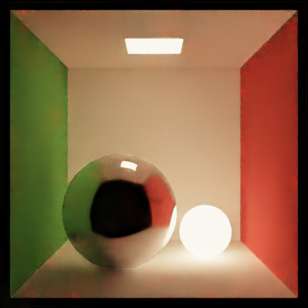
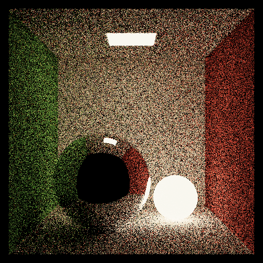
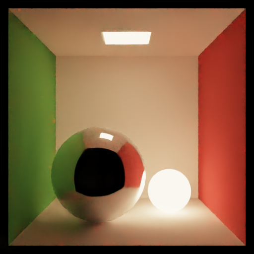
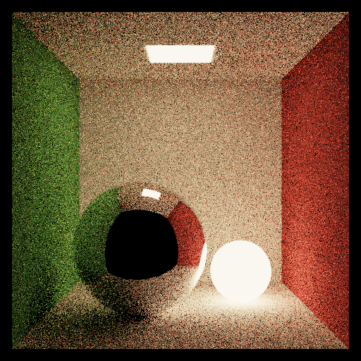
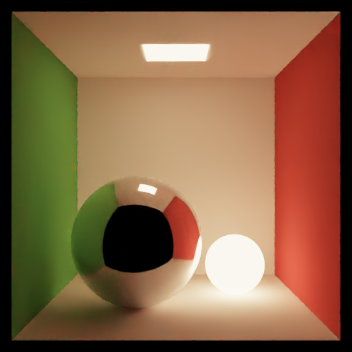
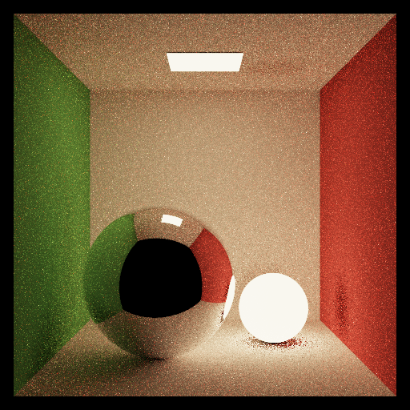
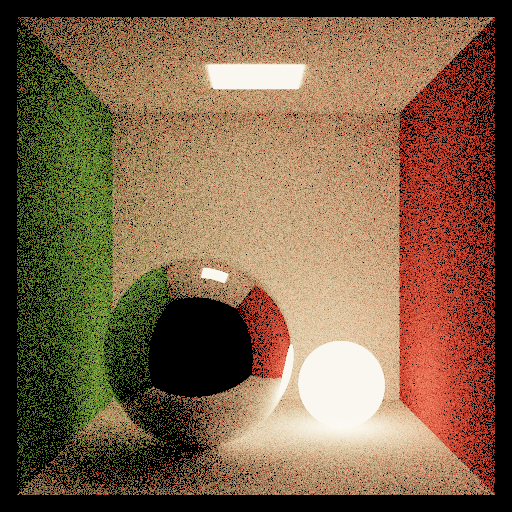
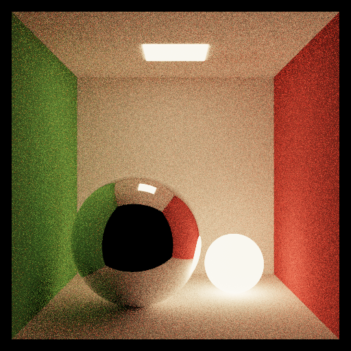
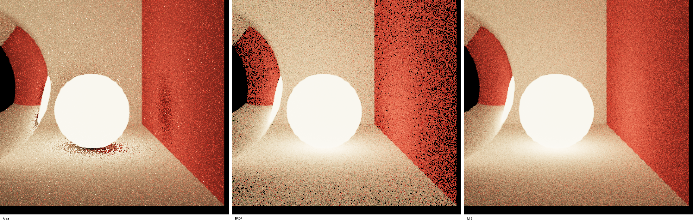

# Multiple-Importance-Sampling

## For CPU Build

```bash
mkdir build && cd build
cmake ..
make -j8
```

## For GPU Build

```bash
mkdir build && cd build 
cmake -DENABLE_GPU=ON -DCMAKE_CUDA_COMPILER=/usr/local/cuda-11.8/bin/nvcc -DCMAKE_CUDA_HOST_COMPILER=/usr/bin/gcc-11 .. 
make -j8
```

## Example Run

```bash
./render ../assets/json_files/cornell_area_light.json --nee-mode mis -o cornell_area_light.png
```

`--nee-mode` options:

- `area`: light-sampling only
- `brdf`: BRDF-sampling only
- `mis`: multiple importance sampling


## OptiX AI Denoiser

Use it like this:

```bash
./render ../assets/json_files/cornell_area_light.json --nee-mode mis --denoise -o cornell_area_light_denoised.png
```

Notes:

- `--denoise` or `-d` is only available on the GPU build.
- The GPU build uses the bundled headers in `third_party/optix`.
- The denoiser runs after the Monte Carlo render and overwrites the noisy beauty buffer with the denoised result before saving.

How it works in this renderer:

- `--denoise` enables the OptiX denoiser path in `main.cu`.
- When enabled, the renderer allocates extra albedo and normal AOV buffers on the GPU.
- During rendering, the first sample writes primary-hit albedo and normal into those guide buffers.
- After rendering, the code creates an OptiX HDR denoiser with both albedo and normal guides enabled.
- It computes HDR intensity, sets up `OptixImage2D` views for color, albedo, and normal, and invokes the denoiser in-place on the rendered image buffer.
- The denoised image is then copied back to the host and written out as the final PNG.

Pipeline summary:

1. Render noisy HDR image on the GPU.
2. Store albedo and normal guide AOVs.
3. Run OptiX HDR denoising on the GPU.
4. Save the denoised image.


## MIS Sampling vs Denoised

These denoised comparisons are reference results from the original MIS experiments.

<table width="100%">
  <tr>
    <td width="16%" align="center"><strong>SPP</strong></td>
    <td width="42%" align="center"><strong>Sampling</strong></td>
    <td width="42%" align="center"><strong>Denoised</strong></td>
  </tr>
  <tr>
    <td width="16%" align="center"><strong>1</strong></td>
    <td width="42%"></td>
    <td width="42%"></td>
  </tr>
  <tr>
    <td width="16%" align="center"><strong>4</strong></td>
    <td width="42%"></td>
    <td width="42%"></td>
  </tr>
  <tr>
    <td width="16%" align="center"><strong>16</strong></td>
    <td width="42%"></td>
    <td width="42%"></td>
  </tr>
</table>

## 16 spp + Denoiser vs 4096 spp

<table width="100%">
  <tr>
    <td width="50%" align="center"><strong>16 spp + Denoiser</strong></td>
    <td width="50%" align="center"><strong>4096 spp</strong></td>
  </tr>
  <tr>
    <td width="50%"></td>
    <td width="50%"></td>
  </tr>
</table>

## Time Comparison

| Method | GPU Render Time | Denoise Time | Total |
| --- | ---: | ---: | ---: |
| 16 spp + Denoiser | 707.632 ms | 101.838 ms | 809.470 ms |
| 4096 spp | 184499.863 ms | - | 184499.863 ms |

## Quality Comparison

Normalized RGB error between `16 spp + Denoiser` and `4096 spp`:

| Metric | Value |
| --- | ---: |
| MSE | 0.0003269 |
| RMSE | 0.0180810 |
| MAE | 0.0098506 |
| PSNR | 34.8556 dB |

## Light Sampling vs BRDF Sampling vs MIS

<table width="100%">
  <tr>
    <td width="33%" align="center"><strong>Light Sampling</strong></td>
    <td width="33%" align="center"><strong>BRDF Sampling</strong></td>
    <td width="33%" align="center"><strong>MIS</strong></td>
  </tr>
  <tr>
    <td width="33%"></td>
    <td width="33%"></td>
    <td width="33%"></td>
  </tr>
</table>

### Zoomed Sphere-Floor Region


