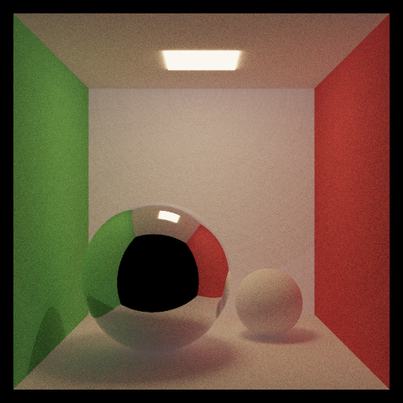

<!-- g++ -x c++ main.cu bvh.cu -std=c++11 -I ../third_party/glm/ -o bvh_check

nvcc --extended-lambda --expt-relaxed-constexpr -I ../third_party/glm/ main.cu bvh.cu -o bvh_check -->

# Multiple-Importance-Sampling

This `HW4` branch keeps the `RayTracer/GPUandCPU` layout from HW4 and folds in the MIS renderer work on top of it.

What is preserved from HW4:

- texture sampling through `texture.h`
- `albedo_map`
- `bump_map`
- `normal_map`

What is added from MIS:

- emissive mesh / area-light sampling
- `--nee-mode area|brdf|mis`
- MIS-based direct-light integration inside the HW4 renderer

## For CPU Build

```bash
mkdir build && cd build
cmake ..
make -j8
```

## For GPU Build

```bash
mkdir build && cd build 
cmake -DENABLE_GPU=ON -DCMAKE_CUDA_COMPILER=/usr/local/cuda-11.8/bin/nvcc -DCMAKE_CUDA_HOST_COMPILER=/usr/bin/gcc-11 .. 
make -j8
```

## Example Run

```bash
./render ../assets/json_files/sphere_single.json --nee-mode mis -o sphere_single.png
```

`--nee-mode` options:

- `area`: light-sampling only
- `brdf`: BRDF-sampling only
- `mis`: multiple importance sampling

## Reference MIS Results

The images below are carried over from the original MIS project README as reference comparisons for the sampling work.



## MIS Sampling vs Denoised

These denoised comparisons are reference results from the original MIS experiments.

<table width="100%">
  <tr>
    <td width="16%" align="center"><strong>SPP</strong></td>
    <td width="42%" align="center"><strong>Sampling</strong></td>
    <td width="42%" align="center"><strong>Denoised</strong></td>
  </tr>
  <tr>
    <td width="16%" align="center"><strong>1</strong></td>
    <td width="42%"></td>
    <td width="42%"></td>
  </tr>
  <tr>
    <td width="16%" align="center"><strong>4</strong></td>
    <td width="42%"></td>
    <td width="42%"></td>
  </tr>
  <tr>
    <td width="16%" align="center"><strong>16</strong></td>
    <td width="42%"></td>
    <td width="42%"></td>
  </tr>
</table>

## 16 spp + Denoiser vs 4096 spp

<table width="100%">
  <tr>
    <td width="50%" align="center"><strong>16 spp + Denoiser</strong></td>
    <td width="50%" align="center"><strong>4096 spp</strong></td>
  </tr>
  <tr>
    <td width="50%"></td>
    <td width="50%"></td>
  </tr>
</table>

## Time Comparison

| Method | GPU Render Time | Denoise Time | Total |
| --- | ---: | ---: | ---: |
| 16 spp + Denoiser | 707.632 ms | 101.838 ms | 809.470 ms |
| 4096 spp | 184499.863 ms | - | 184499.863 ms |

## Quality Comparison

Normalized RGB error between `16 spp + Denoiser` and `4096 spp`:

| Metric | Value |
| --- | ---: |
| MSE | 0.0003269 |
| RMSE | 0.0180810 |
| MAE | 0.0098506 |
| PSNR | 34.8556 dB |

## Light Sampling vs BRDF Sampling vs MIS

<table width="100%">
  <tr>
    <td width="33%" align="center"><strong>Light Sampling</strong></td>
    <td width="33%" align="center"><strong>BRDF Sampling</strong></td>
    <td width="33%" align="center"><strong>MIS</strong></td>
  </tr>
  <tr>
    <td width="33%"></td>
    <td width="33%"></td>
    <td width="33%"></td>
  </tr>
</table>

### Zoomed Sphere-Floor Region


